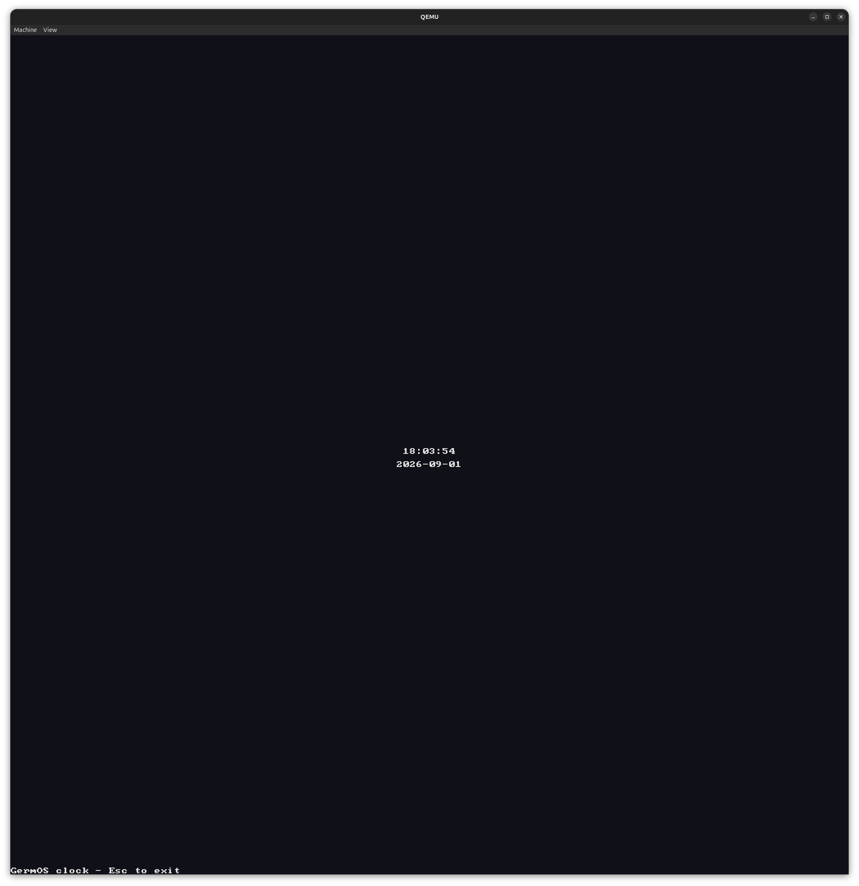

# GermOS

An operating system that is grown on each machine rather than shipped to it: a small trusted core boots the computer and connects it to Claude, which writes everything else — kernel, drivers, applications — as machine code fitted to that exact hardware, and nothing touches the real machine until it has survived a rehearsal on a copy.

The name carries both meanings: the **germline** it grows from, and the benign **germ** that settles into a machine, phones a faraway server, and starts mutating.

Everything here follows one rule: **nothing that exists for human convenience is allowed to run at runtime.** Human convenience belongs in the conversation, at authorship time. Claude is the last interpreter, moved out of the machine and into the cloud, with English as the source language — the interpretation cost is paid once, at authorship, not on every run. The full design is in [`ai-os-foundation.md`](ai-os-foundation.md), the project's single source of truth. `HANDOVER.md` is the rolling state.

## The story so far

The project went live on 31 August 2026 with an empty folder. Every stage is a growth ring: small enough to finish, ends with something you can see, and gated by acceptance tests written before the code existed.

| Stage | What grew | Closed | Picture |
|---|---|---|---|
| **0 — First pixel** | A 512-byte BIOS boot sector: Spectrum loading stripes and a hello over serial. 211 of 510 bytes used. | 31 Aug 2026 — pixels by teatime | [the stripes](history/2026-08-31-stage0-stripes.png) |
| **1 — Owning the processor** | A hand-written PE32+ UEFI application: own GDT and paging, all cores woken with INIT-SIPI-SIPI, each painting its own band at native resolution. The picture *is* the core count. | 31 Aug 2026 | [eight bands, eight cores](history/2026-08-31-stage1-bands.png) |
| **2 — Senses** | Interrupt-driven PS/2 keyboard and a framebuffer text console. First words typed into the OS: *hello world. yay. thank you claude.* | 1 Sep 2026, midnight | [the first words](history/2026-09-01-stage2-first-words.png) |
| **3 — Memory of its own** | A virtio-blk driver and an append-only notebook filesystem, grown overnight in one unattended run. Typed lines survive a reboot: *"It remembers!"* | 1 Sep 2026 | [it remembers](history/2026-09-01-stage3-it-remembers.png) |
| **4 — The umbilical** | virtio-net, a minimal TCP/IP stack, and a caged network with one door to a broker that relays to Claude. The booted OS asked Claude its first question and printed the answer. | 1 Sep 2026 | [the first conversation](history/2026-09-01-first-conversation.png) |
| **5 — The conversation** | The loop closes. A line typed `! ...` goes to Claude and comes back as machine code, **rehearsed in a twin boot before it may run**, then cached in the germline. *"Make me a clock"* produced a running clock — with the date and an exit line nobody asked for. | 1 Sep 2026 | [the first grown clock](history/2026-09-01-first-grown-clock.png) · [the boot log](history/2026-09-01-stage5-boot-log.png) |

The pictures in `history/` are the machine's own screendumps, taken by each stage's acceptance harness (Stage 4's and Stage 5's are window captures from the oracle runs).



Next: **Stage 6 — growth.** A simple compositor and GUI shaped by the human-factors constitution rather than by existing desktops, more devices, and the store of plans: install an application from a plan file.

## Running it

Everything runs inside QEMU — that is a design rule, not a convenience: nothing touches real hardware until Stage 7, on a sacrificial machine. On Ubuntu:

```
sudo apt install nasm qemu-system-x86 ovmf mtools python3
```

Each stage keeps a frozen acceptance gate — `./stageN/test.sh` from the repo root builds it and proves it still works. To *see* each one:

**Stage 0** — stripes and a serial hello:

```
./stage0/test.sh
qemu-system-x86_64 -drive format=raw,file=stage0/out/stage0.img -serial stdio
```

**Stage 1** — one band per core (the machine's core count, painted):

```
./stage1/mkimage.sh
qemu-system-x86_64 -machine q35 -m 256M -smp 8 -bios /usr/share/ovmf/OVMF.fd \
  -drive format=raw,file=stage1/out/esp.img -serial stdio
```

**Stage 2** — type at the prompt:

```
./stage2/mkimage.sh
qemu-system-x86_64 -machine q35 -m 256M -smp 8 -bios /usr/share/ovmf/OVMF.fd \
  -drive format=raw,file=stage2/out/esp.img -serial stdio
```

**Stage 3** — type a line, quit, boot again: it remembers.

```
./stage3/mkimage.sh
truncate -s 16M stage3/out/notes.img
qemu-system-x86_64 -machine q35 -m 256M -smp 8 -bios /usr/share/ovmf/OVMF.fd \
  -drive format=raw,file=stage3/out/esp.img \
  -drive format=raw,file=stage3/out/notes.img,if=virtio -serial stdio
```

**Stage 4** — ask Claude a question from inside the OS. Two terminals; the broker shells out to the [Claude Code CLI](https://claude.com/claude-code) (`claude`), which must be installed and logged in:

```
python3 broker/broker.py
```

```
./stage4/mkimage.sh
truncate -s 16M stage4/out/notes.img
qemu-system-x86_64 -machine q35 -m 256M -smp 8 -bios /usr/share/ovmf/OVMF.fd \
  -drive format=raw,file=stage4/out/esp.img \
  -drive format=raw,file=stage4/out/notes.img,if=virtio \
  -netdev 'user,id=n0,restrict=on,guestfwd=tcp:10.0.2.4:9999-cmd:nc -N 127.0.0.1 9999' \
  -device virtio-net-pci,netdev=n0 -serial stdio
```

Type `? ` and a question. A line without the marker is a note, and persists — exactly as Stage 3. The guest's network is a cage: `restrict=on` means it can reach nothing at all except that one forwarded socket to the broker on localhost.

**Stage 5** — ask the OS to grow something. The Stage 5 broker answers questions *and* requests; on a request it asks Claude for a flat binary against the ABI in [`stage5/GERMLINE.md`](stage5/GERMLINE.md), **rehearses it in a headless boot of the same image** (the twin) before it is allowed anywhere near your screen, caches what passed in `germline/` (per machine, gitignored), and delivers it. Two terminals:

```
python3 broker/germline.py
```

```
./stage5/mkimage.sh
truncate -s 16M stage5/out/notes.img
qemu-system-x86_64 -machine q35 -m 256M -smp 8 -bios /usr/share/ovmf/OVMF.fd \
  -drive format=raw,file=stage5/out/esp.img \
  -drive format=raw,file=stage5/out/notes.img,if=virtio \
  -netdev 'user,id=n0,restrict=on,guestfwd=tcp:10.0.2.4:9999-cmd:nc -N 127.0.0.1 9999' \
  -device virtio-net-pci,netdev=n0 -serial stdio
```

Type `! make me a clock`. The indicator turns while Claude writes and the twin rehearses; a clock ticks; **Esc** brings the prompt back; ask again and it comes from the germline at once. `?` still asks (with or without the space now), and a plain line is still a note. The automated gate (`./stage5/test.sh`) uses only a mock broker with a canned test component, so it never spends a token.

**Stage 6, ring 6a — the glass.** The screen gets one owner: a dedicated core composites four regions — an obs strip of live counters on top, a choices row at the bottom, the conversation on the left, the app on the right — from surfaces in RAM, sixty frames a second. An app is four callbacks (`init`, `step`, `key`, `exit`, per [`stage6/GLASS.md`](stage6/GLASS.md)) stepped by the main loop, so the conversation stays alive beside it. The display's EDID picks the mode, so QEMU is given a display that states one. Two terminals:

```
python3 broker/glass.py
```

```
./stage6/mkimage.sh
truncate -s 16M stage6/out/notes.img
qemu-system-x86_64 -machine q35 -m 256M -smp 8 -bios /usr/share/ovmf/OVMF.fd \
  -vga none -device VGA,edid=on,xres=1440,yres=1440 \
  -drive format=raw,file=stage6/out/esp.img \
  -drive format=raw,file=stage6/out/notes.img,if=virtio \
  -netdev 'user,id=n0,restrict=on,guestfwd=tcp:10.0.2.4:9999-cmd:nc -N 127.0.0.1 9999' \
  -device virtio-net-pci,netdev=n0 -serial stdio
```

Type `! make me a clock`: the strip says `growing` while Claude writes and the twin rehearses, then the clock ticks in the app panel with `running make me a` on the strip. **Tab** gives the keys to the prompt — type a note beside the running clock — and **Tab** gives them back; **Esc** closes the app. The choices row always says what the keys do. The Stage 5 clock in `germline/` is an ABI 1 entry: ring 6a keys its germline `abi2`, so the first request regenerates. The automated gate (`./stage6/test.sh`) speaks only to the mock and its canned apps, and spends no token.

## The team of three

GermOS is built by a team of three, and the division of labour is the experiment as much as the OS is:

- **Wajira** ([@IndyWH](https://github.com/IndyWH)) — product owner and QA oracle. A UK GP and health-informatician who verifies every stage by eyeball; the medical model runs through the project's verification (the trial protocol precedes the treatment).
- **Claude Cowork** — design and specs. Writes each stage's one-page spec for approval, reviews every diff, flags the judgement calls.
- **Claude Code** — implementation. Writes all the assembly, one commit per numbered plan item, tests green before every commit — mechanically held to an approved plan by hooks it cannot edit.

The acceptance tests are written before the code and frozen by a hook; the human's word is the final gate of every stage. Every spec, plan, decision and mistake is in the git history and `HANDOVER.md` — the project's coordination channel is the audit trail.

## What this is not

Not a Linux replacement. Not a product. Not secure enough to trust with anything that matters — and never, under any circumstances, connected to clinical work or patient data. It is a laboratory for one thesis — that software can be grown rather than shipped — and the most fun available per kilobyte.

## Licence

[MIT](LICENSE).
